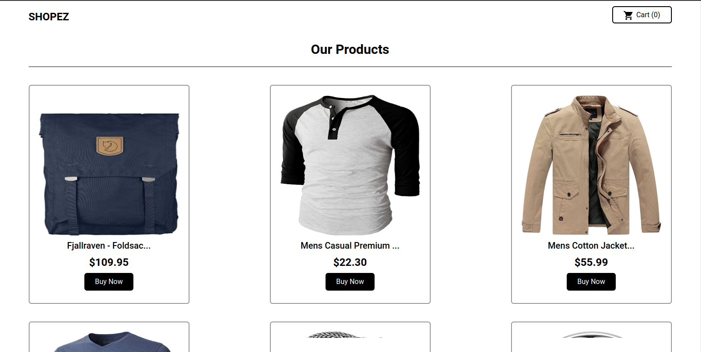

# SHOPEZ

Shopee is an e-commerce that provides a variety of needs. the data is taken from the fake api store

## Table of contents

- [Overview](#overview)
  - [Link](#link)
  - [Screenshot](#screenshot)
  - [Deploy](#deploy)
- [My process](#my-process)
  - [Built with](#built-with)
- [Author](#author)

# Overview

## Link

> Website: [https://shopez-denny.vercel.app/](https://shopez-denny.vercel.app/)

## Screenshot

## Deploy

- [vercel](https://shopez-denny.vercel.app/)

## My process

### Built with

- React
- TypeScript
- Tailwind
- Axios
- React Router

## Source Code

- GitHub - [https://github.com/dennyshuda/shopez](https://github.com/dennyshuda/shopez)
